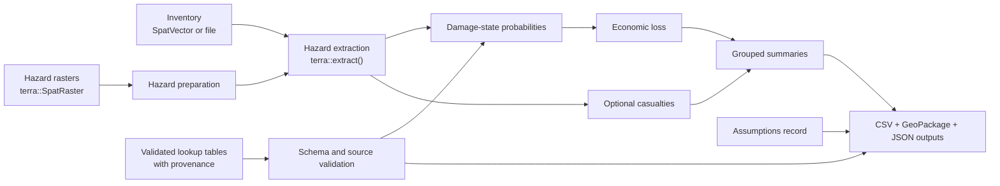
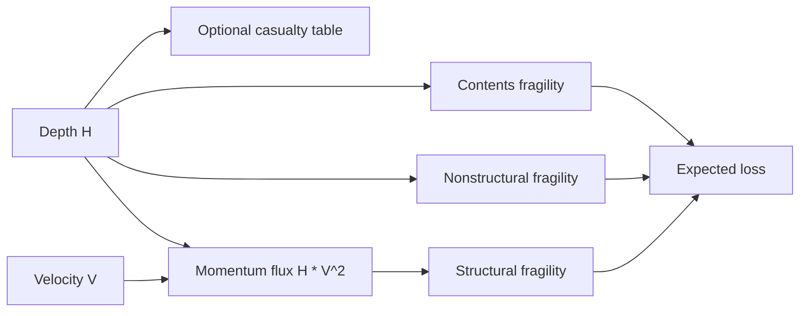
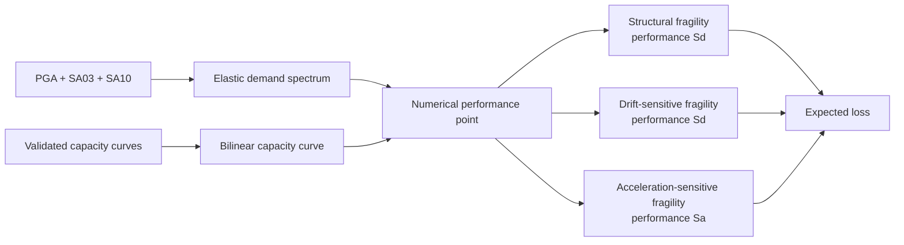

# hazgrid

`hazgrid` is an independent R framework for transparent, programmable
FEMA Hazus-style hazard and loss workflows outside ArcGIS. It is designed for
analysts who need reproducible spatial pipelines, inspectable assumptions, and
small modular functions instead of opaque desktop processing steps.

The package is **not FEMA Hazus**, is **not affiliated with FEMA**, and does not
claim to reproduce official Hazus results by itself. Real analyses require
official FEMA Hazus lookup tables or independently validated alternatives,
appropriate hazard inputs, a reviewed inventory, explicit units, and documented
assumptions.

> **Do not use bundled demo tables for real-world decisions.** Files under
> `inst/extdata/demo/` contain invented synthetic values for tests and examples.
> They are rejected by default and run only when
> `allow_demo_tables = TRUE` is supplied explicitly.

## Current Scope

| Workflow | Current support | Analytical boundary |
|---|---|---|
| Tsunami Level 2 | Depth raster + velocity raster; computes `H * V^2` | Requires validated fragility and loss-ratio tables |
| Tsunami Level 3 | Depth raster + momentum-flux raster | Requires validated fragility and loss-ratio tables |
| Tsunami casualties | Optional validated depth-bin casualty table | Isolated component so casualty methods can evolve |
| Earthquake hazard | PGA, SA at 0.3 sec, SA at 1.0 sec, optional PGV | User-supplied aligned rasters |
| Earthquake capacity spectrum | Elastic demand spectrum, validated bilinear capacity retrieval, numerical performance point, structural and nonstructural fragilities | Full Hazus effective-damping and demand-reduction iteration remains under development |
| Summaries and outputs | CSV tables, GeoPackage assets, assumptions JSON, lookup validation CSV | Designed for traceability |

## Why hazgrid

- `terra` is the required spatial engine for rasters and vectors.
- ArcGIS and proprietary Hazus software are not required.
- Hazard extraction, damage probabilities, loss calculations, casualty
  calculations, assumptions, lookup validation, and summaries are separate
  stages.
- Lookup tables carry provenance metadata and are validated before analysis.
- Demo tables cannot silently enter a real workflow.
- Base R data frames keep the core package lightweight and CRAN-friendly.
- Optional DuckDB, Arrow, GeoParquet, and `data.table` acceleration can be added
  without changing the public workflow design.

## Workflow Overview



The high-level runners return intermediate tables as well as final results.
Analysts can inspect, save, or replace any stage.

## Installation

Install the package from GitHub:

```r
install.packages("remotes")
remotes::install_github("el-cordero/hazgrid")
```

For local development:

```r
install.packages("terra")
install.packages(".", repos = NULL, type = "source")
```

Load the package:

```r
library(hazgrid)
library(terra)
```

## Lookup Tables and Provenance

Real analyses must use official FEMA Hazus lookup tables or independently
validated alternatives. `hazgrid` does not fabricate or bundle official values.

Every validated lookup row must include:

| Metadata column | Purpose |
|---|---|
| `source_name` | Document, database, or reviewed source |
| `source_version` | Source release or version |
| `source_table` | Original source table identifier |
| `source_page` | Source page where applicable; use a documented non-applicable value otherwise |
| `validated_by` | Reviewer or validation process |
| `validation_date` | ISO date such as `2026-06-02` |
| `validation_status` | `official_fema_hazus`, `independently_validated`, or `demo_only` |
| `units` | Units expected by the lookup values |
| `notes` | Limitations, transformations, or review notes |

Typed schema templates are installed under `inst/extdata/schemas/`:

| Table type | Schema template |
|---|---|
| `tsunami_fragility` | `tsunami_fragility.csv` |
| `tsunami_loss_ratio` | `tsunami_loss_ratio.csv` |
| `tsunami_casualty` | `tsunami_casualty.csv` |
| `earthquake_capacity_curve` | `earthquake_capacity_curve.csv` |
| `earthquake_structural_fragility` | `earthquake_structural_fragility.csv` |
| `earthquake_nonstructural_drift_fragility` | `earthquake_nonstructural_drift_fragility.csv` |
| `earthquake_nonstructural_acceleration_fragility` | `earthquake_nonstructural_acceleration_fragility.csv` |
| `earthquake_loss_ratio` | `earthquake_loss_ratio.csv` |
| `earthquake_design_level_mapping` | `earthquake_design_level_mapping.csv` |
| `earthquake_occupancy_mapping` | `earthquake_occupancy_mapping.csv` |
| `restoration_function` | `restoration_function.csv` |

Inspect the installed templates:

```r
schema_dir <- system.file("extdata", "schemas", package = "hazgrid")
list.files(schema_dir)
```

Read and validate a real table:

```r
fragility <- read_hazgrid_lookup(
  "path/to/validated_tsunami_fragility.csv",
  table_type = "tsunami_fragility"
)
```

Validation checks required columns, provenance, damage states, duplicate keys,
numeric ranges, table-specific units, and consistency rules. This confirms that
a table is internally suitable for processing; it does not independently
certify whether source values were transcribed or validated correctly.

## Units

Hazard units are explicit. Use `terra::units()` for rasters and
`convert_hazard_units()` for reviewed conversions.

| Quantity | Metric units | Imperial units |
|---|---|---|
| Depth | `m` | `ft` |
| Velocity | `m/s`, `cm/s` | `ft/s` |
| Acceleration | `g`, `m/s2`, `cm/s2` | `ft/s2` |
| Momentum flux | `m3/s2` | `ft3/s2` |

Depth and velocity must use the same measurement system before tsunami
momentum flux is calculated. Velocity in `cm/s` is recognized as metric, but it
must be converted explicitly to `m/s` or requested with
`auto_convert_units = TRUE`:

```r
velocity_mps <- convert_hazard_units(
  velocity_cmps,
  from = "cm/s",
  to = "m/s",
  quantity = "velocity"
)
```

## Tsunami Workflow

Tsunami structural damage uses momentum flux:

```text
HV2 = H * V^2
```

Nonstructural damage, contents damage, and optional casualty calculations use
inundation depth `H`.



### Real Level 2 Analysis

Level 2 takes inundation depth and velocity rasters:

```r
result <- run_tsunami_loss(
  inventory = "path/to/buildings.gpkg",
  depth = rast("path/to/depth.tif"),
  velocity = rast("path/to/velocity.tif"),
  fragility_table = "path/to/validated_tsunami_fragility.csv",
  loss_ratio_table = "path/to/validated_tsunami_loss_ratio.csv",
  group_fields = c("municipality", "occupancy"),
  output_dir = "outputs/tsunami-level2"
)
```

### Real Level 3 Analysis

Level 3 accepts momentum flux directly:

```r
result <- run_tsunami_loss(
  inventory = "path/to/buildings.gpkg",
  depth = rast("path/to/depth.tif"),
  momentum_flux = rast("path/to/momentum_flux.tif"),
  fragility_table = "path/to/validated_tsunami_fragility.csv",
  loss_ratio_table = "path/to/validated_tsunami_loss_ratio.csv",
  group_fields = "municipality"
)
```

### Optional Casualties

Casualties are opt-in and require a validated table and an explicit population
field:

```r
result <- run_tsunami_loss(
  inventory = "path/to/buildings.gpkg",
  depth = rast("path/to/depth.tif"),
  velocity = rast("path/to/velocity.tif"),
  fragility_table = "path/to/validated_tsunami_fragility.csv",
  loss_ratio_table = "path/to/validated_tsunami_loss_ratio.csv",
  casualty_table = "path/to/validated_tsunami_casualty.csv",
  include_casualties = TRUE,
  population_field = "population_day"
)
```

### Synthetic Tsunami Demo

This example is runnable offline. It demonstrates package mechanics only.

```r
ext <- function(...) system.file("extdata", ..., package = "hazgrid")

tsunami_demo <- run_tsunami_loss(
  inventory = ext("synthetic_buildings.gpkg"),
  depth = rast(ext("synthetic_depth.tif")),
  velocity = rast(ext("synthetic_velocity.tif")),
  fragility_table = ext("demo", "demo_tsunami_fragility.csv"),
  loss_ratio_table = ext("demo", "demo_tsunami_loss_ratio.csv"),
  casualty_table = ext("demo", "demo_tsunami_casualty.csv"),
  include_casualties = TRUE,
  population_field = "population_day",
  group_fields = "municipality",
  allow_demo_tables = TRUE
)

tsunami_demo$summary
```

Representative synthetic output:

| municipality | assets | total loss | expected fatalities | expected injuries | mean depth `H` |
|---|---:|---:|---:|---:|---:|
| North | 6 | 472,899 | 0.115 | 0.60 | 1.53 |
| South | 6 | 1,716,371 | 0.288 | 1.28 | 3.70 |

These numbers are synthetic and have no real-world analytical meaning.

## Earthquake Capacity-Spectrum Workflow

The earthquake workflow is being upgraded toward the Hazus capacity-spectrum
method. The current implementation:

1. Prepares aligned `PGA`, `SA03`, `SA10`, and optional `PGV` rasters.
2. Builds an elastic standard demand-spectrum shape.
3. Retrieves validated bilinear yield and ultimate capacity parameters.
4. Solves a transparent numerical elastic-demand intersection.
5. Applies validated structural fragilities using performance spectral
   displacement.
6. Applies optional drift-sensitive and acceleration-sensitive nonstructural
   fragilities.
7. Converts damage probabilities to expected losses when a validated
   earthquake loss-ratio table is supplied.



### Important Earthquake Limitation

The current performance point is an elastic-demand intersection. The complete
Hazus effective-damping and iterative demand-reduction procedure is still under
development. `hazgrid` emits a warning and records this limitation in the
returned assumptions. It does not silently fall back to a PGA-only shortcut.

### Real Earthquake Analysis Structure

```r
earthquake <- run_earthquake_loss(
  inventory = "path/to/buildings.gpkg",
  pga = rast("path/to/pga.tif"),
  sa03 = rast("path/to/sa03.tif"),
  sa10 = rast("path/to/sa10.tif"),
  pgv = rast("path/to/pgv.tif"),
  capacity_table = "path/to/validated_capacity_curve.csv",
  structural_fragility_table = "path/to/validated_structural_fragility.csv",
  drift_fragility_table = "path/to/validated_drift_fragility.csv",
  accel_fragility_table = "path/to/validated_acceleration_fragility.csv",
  loss_ratio_table = "path/to/validated_earthquake_loss_ratio.csv",
  group_fields = "municipality",
  output_dir = "outputs/earthquake"
)
```

### Inspect the Demand Spectrum

The demand-spectrum stage can be inspected independently:

```r
spectrum <- build_demand_spectrum(
  pga = 0.20,
  sa03 = 0.50,
  sa10 = 0.25
)

head(spectrum)

plot(
  spectrum$spectral_displacement,
  spectrum$spectral_acceleration,
  type = "l",
  xlab = "Spectral displacement (in)",
  ylab = "Spectral acceleration (g)",
  main = "Elastic demand spectrum"
)
```

### Synthetic Earthquake Demo

This example is runnable offline and must not be interpreted as a real loss
estimate:

```r
earthquake_demo <- suppressWarnings(run_earthquake_loss(
  inventory = ext("synthetic_buildings.gpkg"),
  pga = rast(ext("synthetic_pga.tif")),
  sa03 = rast(ext("synthetic_sa03.tif")),
  sa10 = rast(ext("synthetic_sa10.tif")),
  pgv = rast(ext("synthetic_pgv.tif")),
  capacity_table = ext("demo", "demo_earthquake_capacity_curve.csv"),
  structural_fragility_table = ext("demo", "demo_earthquake_structural_fragility.csv"),
  drift_fragility_table = ext("demo", "demo_earthquake_nonstructural_drift_fragility.csv"),
  accel_fragility_table = ext("demo", "demo_earthquake_nonstructural_acceleration_fragility.csv"),
  loss_ratio_table = ext("demo", "demo_earthquake_loss_ratio.csv"),
  group_fields = "municipality",
  allow_demo_tables = TRUE
))

earthquake_demo$summary
```

Representative synthetic output:

| municipality | assets | total loss | structural loss | drift-sensitive loss | acceleration-sensitive loss |
|---|---:|---:|---:|---:|---:|
| North | 6 | 585,457 | 260,254 | 193,869 | 131,335 |
| South | 6 | 1,723,295 | 818,658 | 577,725 | 326,911 |

Again, these values are synthetic and are not valid for decisions.

## Assumptions and Output Artifacts

Every high-level workflow returns:

| Result field | Contents |
|---|---|
| `exposure` | Inventory attributes plus extracted hazard values |
| `damage` | Asset-level damage-state probabilities |
| `loss` | Asset-level expected losses when available |
| `casualty` | Optional tsunami casualty results |
| `summary` | Optional grouped summary |
| `assumptions` | Structured analysis assumptions |
| `lookup_validation` | Provenance and validation report |
| `output_paths` | Written output locations |

When `output_dir` is supplied, workflows write:

- exposure CSV
- damage CSV
- loss CSV when available
- casualty CSV when requested
- summary CSV when requested
- assets GeoPackage
- assumptions JSON
- lookup validation CSV

Create or write assumptions directly:

```r
assumptions <- hazgrid_assumptions(
  hazard_model = "tsunami",
  hazard_source = "reviewed scenario rasters",
  inventory_source = "reviewed building inventory",
  analysis_level = "level2",
  notes = "Document local analytical decisions here."
)

write_assumptions(assumptions, "outputs/assumptions.json")
```

## Summary Tables

Summarize by any available inventory attributes:

```r
summarize_by(
  tsunami_demo$loss,
  group_fields = c("municipality", "occupancy")
)
```

Missing grouping values are retained as `"(missing)"`, rather than silently
dropped.

## Deprecated Compatibility Wrappers

The public API now uses:

- `earthquake_damage()`
- `run_earthquake_loss()`
- `tsunami_casualty()`

Older `*_mvp()` names remain temporarily as deprecated wrappers so existing
scripts fail gradually and visibly.

## Development and Validation

Run tests:

```r
testthat::test_local(".")
```

Build and check:

```bash
R CMD build .
R CMD check hazgrid_0.2.0.tar.gz
```

The package is designed so future work can add:

- curated official FEMA Hazus table ingestion
- full earthquake effective-damping and demand-reduction iteration
- expanded tsunami casualty methods
- DuckDB, Arrow, GeoParquet, and `data.table` acceleration
- evacpath integration for evacuation-time inputs
- ground failure, lifelines, debris, shelter, restoration, and combined
  earthquake-tsunami damage

## Responsible Use

`hazgrid` helps make hazard and loss calculations explicit and reproducible. It
does not replace engineering judgment, source-table review, local calibration,
uncertainty analysis, or validation against appropriate reference results.
